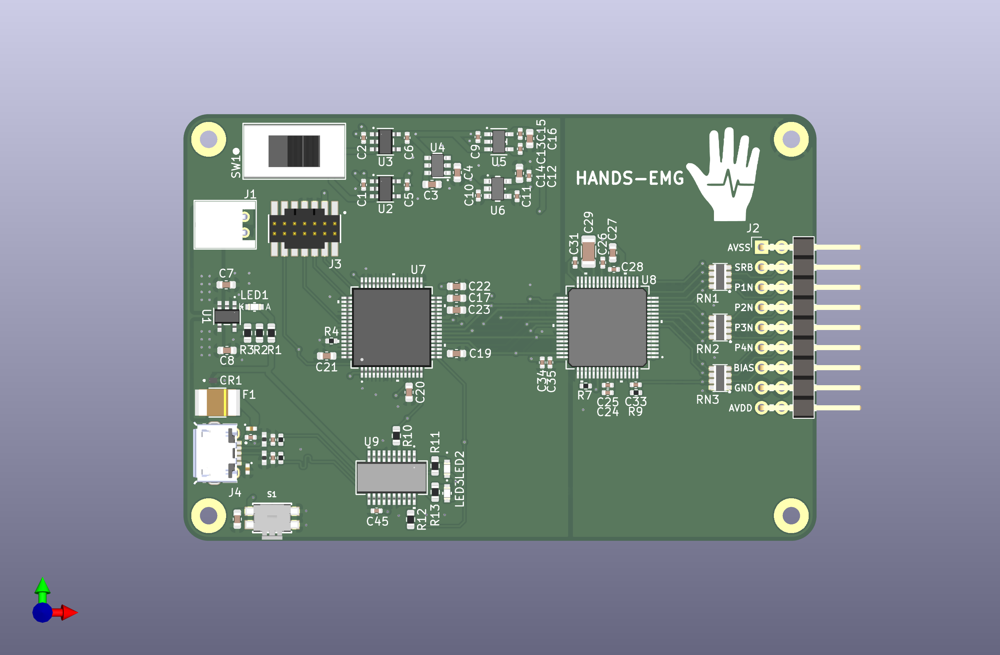

# HANDS-EMG

**HANDS-EMG** is a real-time embedded system designed to read a user's EMG signals and classify their hand movements.

## Project Description
A battery-powered surface electromyography (sEMG) sensor system designed to classify hand movements based on the wearer's muscle activity.
The device utilizes four channels of wet electrodes placed on the user's forearm to capture sEMG signals.
These signals are processed through our procured analog front-end module operating at 2000Hz.
The digitized signals are transmitted to our microcontroller via SPI, where a machine learning algorithm classifies the hand movements based on a pre-trained model.
The system will output the movement classifications via USB, which can be visualized on a PC simulator.
Designed for efficiency, the device operates at a voltage of 3.7V provided by a rechargeable lithium polymer battery for portability.
The current ML model only classifies 3 hand movements: Wrist Flexion, Wrist Extension, and Fist Clench.

## Videos
[Project Overview (Entire Design Process)](https://www.youtube.com/watch?v=24S8prk70tI)

[Demo Video](https://www.youtube.com/watch?v=GeJwxeHSsiM)

## Team

- Blake Pearson
- Noah Marosok
- Kelly Hubbard
- Jayden Sumbillo
- Kirk Young

## About
Developed at **San Diego State University**.

**College of Engineering** -- **Department of Electrical and Computer Engineering (ECE)**

