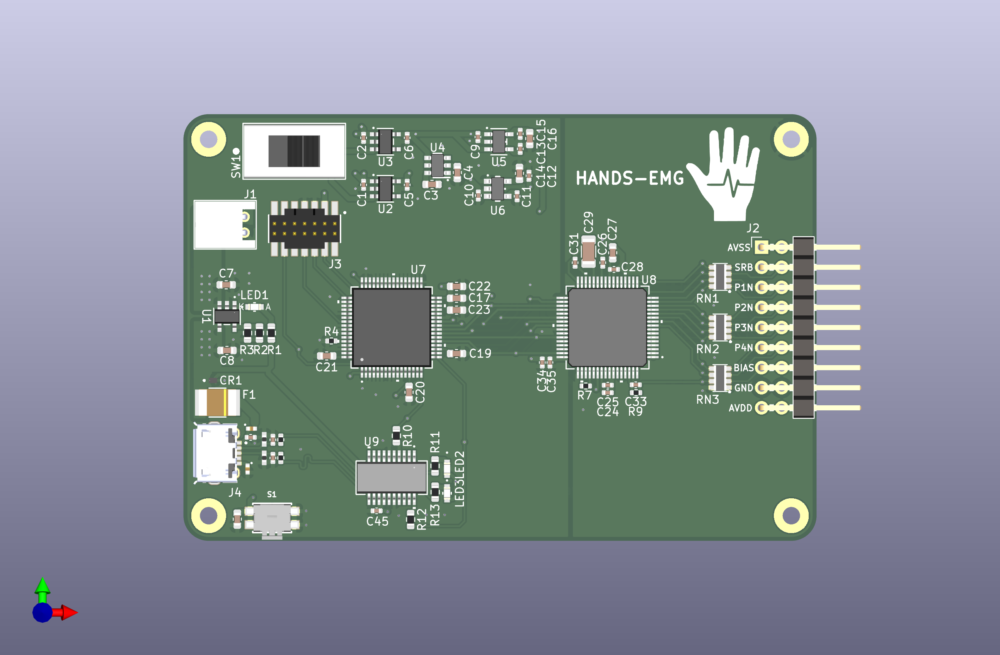

# PCB Projects
Welcome to the PCB repository! This folder contains four PCB phases:

- **Phase 1**
- **Phase 2**
- **Phase 3**

Each project is fully designed in KiCad and includes schematics, PCB layouts, and 3D models.

## Phase Descriptions

### Phase 1

**Description:**  
Contains 3 PCBs, each designed with a specific purpose.

**Key Components:**
- PMIC Board: Provide power to the following two PCBs
- ADS1299 Board: Our AFE board that handles processing and digitizing EMG signals
- STM32 Board: Our uC board that handles classification and compute

**Warnings**
- Do not use this phase, it taught us alot about PCB design but is riddled with issues
- PMIC Board is less than 50% functional.
    - 3.3V line is actually 3.6V which is absolute maximum of STM32
    - -2.5V line is unstable, due to only using a charge pump without a LDO after
- ADS1299 Board is not functional
    - Unknown issue in PCB design that kills the IC.

### Phase 2

**Description:**  
The team's attempt at a fully integrated PCB design.

**Warnings**
- Do not use this phase
- Board's USB to UART is not functional, no communication possible
- SWD footprint is mirrored

### Phase 3 (Final Phase)

**Description:**
The team's final design. Focused on simplicity, cost, and small dimensions. Fully tested and working

**Key Components**
- STM32L0: Our main compute, has the ML model and classifies the signals
- ADS1299: Our AFE, handles amplifying and digitizing our EMG signals
- FT231X: USB->UART IC for simple communication between STM32 and PC

---

## 3D Model Previews

**Final PCB 3D View:**  

---

## How to Open the Projects

1. Install [KiCad](https://kicad.org/) (v9).
2. Open KiCad and navigate to the respective folder (`phase3`).
3. Open the `.kicad_pro` project file inside each folder.
